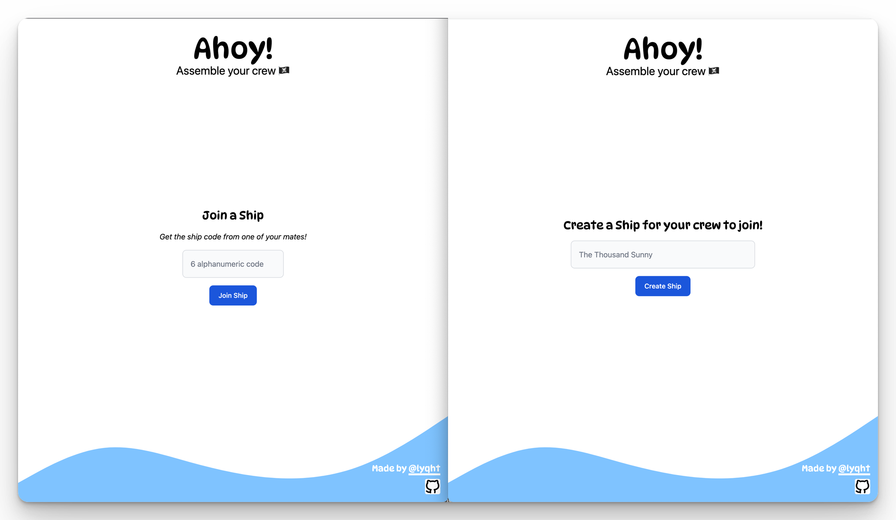
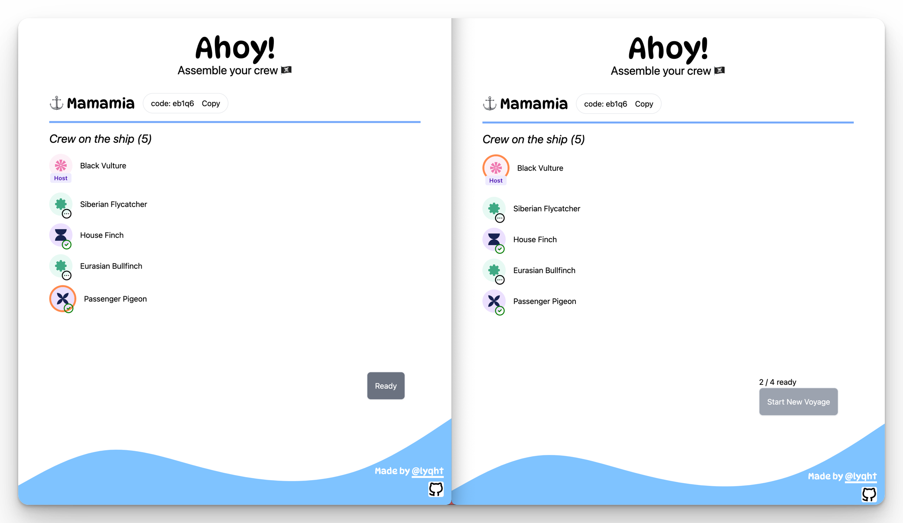
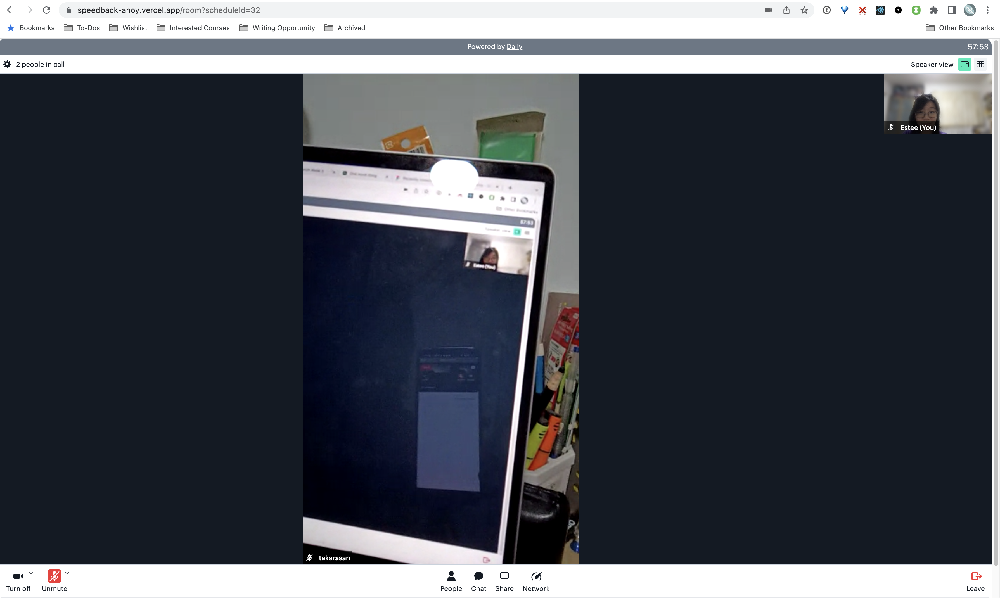

# Ahoy!

A pirate-themed app to generate Zoom-like breakout rooms for your next [Speedback](https://www.google.com/search?q=speedback&sourceid=chrome&ie=UTF-8) session.

## Building Blocks 🧱

- Next.js — SSR, API Routes
- Supabase — Realtime DB & Auth Helpers
- Tailwind CSS, Flowbite — UI
- Daily — Video Calls

## Features 🏴‍☠️

- Join and create your own ships

- All players will be placed in the waiting hall after they join a ship. You can see who has joined the ship.
- Every user will be given a random bird name when they join a new ship 🐤.
- Before starting the session, the crew members can set ready/ not ready status. All crew has to be ready for the captain to start the voyage. All users can see the ready changes reflected instantly.

<i align='center'>Left: View of a crew. Right: View of a captain.</i>

- Once every crew member is ready, the captain can start the speedback session. Users will be automatically be assigned to a room and a partner, and be redirected accordingly to the video call page.
  - In the case of an odd number, 1 person will just see 'You are not assigned to a room yet'.

<i align='center'>Preview at speedback ahoy app, where I used my mobile and desktop to join the same ship as different users</i>

## Features not implemented yet ⏰

> These features were part of the original vision, but were omitted due to lack of time for submission to SupaLaunchWeek5 hackathon.

- Auto-reassignment to the next pair & room
  - At the moment, the round robin schedule & rooms are generated as expected. But I have yet to implement the timeout logic/ postgres triggers & appropriate UI for users to join next room directly after 3mins is up (the usual time for speedback for each pair).
- Log out
  - If you want to test joining the ship as a different user on the same device, open incognito. Otherwise just use separate devices.
- Error handling to show as pop up on UI when API calls fail
- Showing realtime notifications for ship crew list changes
  - e.g. Crew x is ready!
  - e.g. Crew x has joined the room.
  - e.g. Crew x has left the room.
  - e.g. Captain x has left the room.
- If a user closes the tab/browser accidentally, there should be a prompt to ask user if they want to be redirected to the previous room that they are in
  - If the session has not started, join waiting room
  - If the session has started, captain/crew should rejoin the call they were in.
- Late crew to be able to join sesions that have already started.
- Additional Captain functionalities
  -  Rename room
  -  Modify generated pairing schedule
  -  Kick participants
  -  Set co-host of ship
